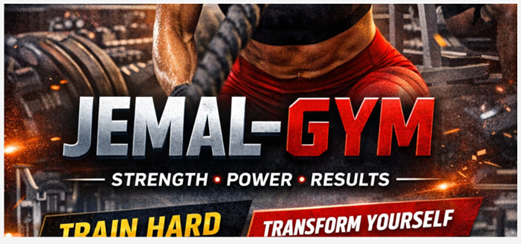
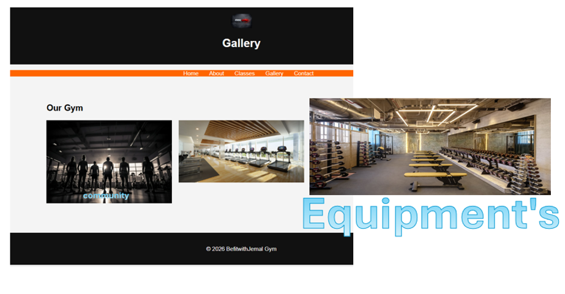
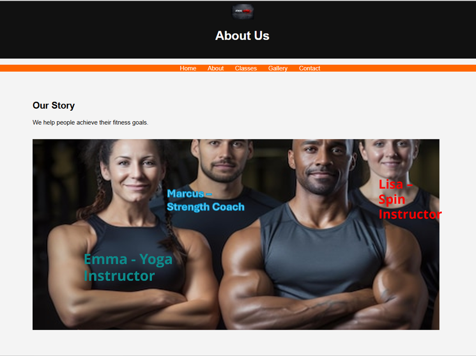
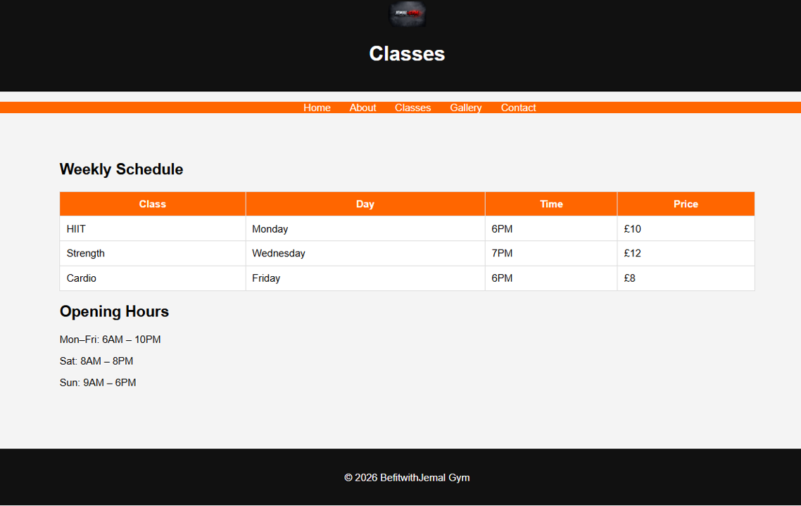

<!-- ======================================================
   BefitwithJemal Gym-milestone-project-1 - README.md
   Author: Jemal Hangela
   Project: User Centric Frontend Development Milestone 1
   Last Updated:06 March 2026
====================================================== -->

# BEFITWITHJEMAL GYM

##  Project Overview

BefitwithJemal Gym is a fully responsive multi-page fitness website developed for the (User Centric Front-End Development Milestone Project).

The website allows users to explore gym services, view class schedules, and join the gym through a simple and intuitive interface.

---

## Purpose

The purpose of this website is to provide users with a clear and professional platform to:

* Learn about gym services
* View class schedules and pricing
* Join the gym easily
* Locate the gym using Google Maps

---

## Target Audience

* Beginners starting their fitness journey
* Intermediate gym users
* Individuals looking for structured training
* Community-focused fitness enthusiasts

---

## User Stories
                                                      
1. As a user, I want to understand what the gym offers so I can decide to join.
2. As a user, I want to view class schedules and prices
3. As a user, I want to contact or join the gym easily.
4. As a user, I want to view images of the gym environment.

---

## Design & Wireframes

Wireframes were created to plan layout and structure for Pages:

1. Home Page → Hero, Image, Video, Features
2. Gallery Page → Image Grid + Lightbox
3. Classes Page → Table + Opening Hours
4. Contact Page→ Form + Map
5. See attached Wireframes PDF.

---

##  Features

* Responsive layout using CSS Grid
* Hero section with background image
* Embedded YouTube video
* Image gallery with CSS lightbox
* Weekly schedule with pricing
* Opening hours section
* Join form
* Google Maps integration
* Consistent navigation across all pages

---

## Technologies Used

* HTML5
* CSS3
* Visual Studio Code
* GitHub
* Google Maps Embed
* Chrome Developer Tools

---

## Project Structure

assets/
  css/style.css
  images/

pages/
  about.html
  classes.html
  contact.html
  gallery.html

index.html
README.md
```

---

## Screenshots

### Home Page


### Gallery Page


### Contact page and join us Form


### About page


###Classes page


## assets/images/screenshots/Video screenshot-Recording .mp4


<<<<<<< HEAD
## Deployment
 Githup pages link: https://github.com/hangelaj/BefitwithJemal-Gym-milestone-project-1
=======
### Mobile View
>>>>>>> 58f8958 (improvements after the result feedbak)


---

<<<<<<< HEAD
## The live site will be available at: https://hangelaj.github.io/BefitwithJemal-Gym-milestone-project-1/
I attempted to deploy my website and provide a live link over the last few weeks; however, I encountered a technical issue and the link is currently not working. Sam advised me to submit the project without the GitHub Pages live link at that time and finaly I have sorted please check the above live link as shown above.
## Website Work on All Screens
=======
##  Testing

### Device Testing
>>>>>>> 58f8958 (improvements after the result feedbak)

| Device  | Result           |
| ------- | ---------------- |
| Mobile  | Fully responsive |
| Tablet  | Layout correct   |
| Desktop | Fully functional |

### Feature Testing

| Feature    | Test                 | Result |
| ---------- | -------------------- | ------ |
| Navigation | Click all links      | Pass   |
| Images     | Load correctly       | Pass   |
| Video      | Plays correctly      | Pass   |
| Form       | Required fields work | Pass   |
| Gallery    | Lightbox works       | Pass   |
| Map        | Loads location       | Pass   |

---

##  Validation

### HTML Validation

* Tested using W3C Validator
* No major errors found

### CSS Validation

* Tested using Jigsaw Validator
* No errors found

---

##  Deployment

The project is deployed using GitHub Pages:

👉 https://hangelaj.github.io/BefitwithJemal-Gym-milestone-project-1/

---

## ♿ Accessibility

* Semantic HTML used
* Alt text for images
* Clear navigation
* Good color contrast

---

## 📌 Attribution

Bootstrap (reference only): https://getbootstrap.com/
Google Fonts: https://fonts.google.com/
Font Awesome: https://fontawesome.com/

All custom HTML and CSS code was written by the developer.

---

## 🔮 Future Improvements

* Add backend functionality
* Add booking system
* Add login system
* Improve animations
* Add dark mode

---

## 🧾 Reflection & Evaluation

This project helped me develop skills in HTML and CSS, particularly in creating responsive layouts and structuring content effectively.

One challenge I faced was ensuring correct file paths for images and maintaining consistency across multiple pages. This was resolved by carefully structuring folders and testing links.

In the future, I would improve the project by adding JavaScript functionality and backend integration to make the website fully interactive.

---

## 👨‍💻 Author

Jemal Hangela
Level 5 Diploma in Web Application Development
User Centric Front-End Development – Milestone Project 1
